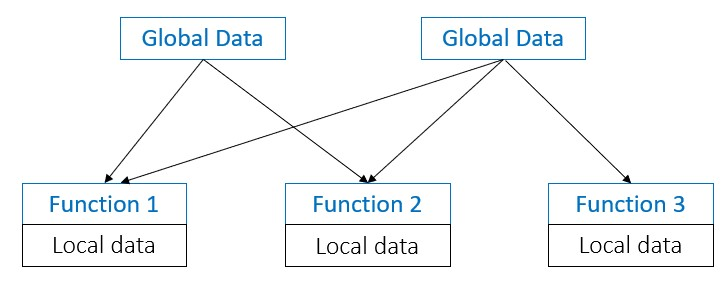
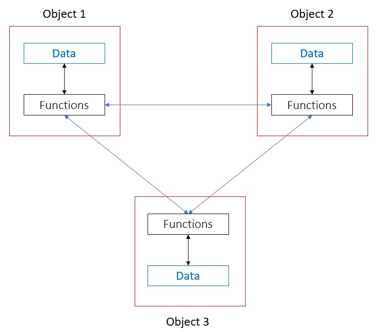

# Programming Paradigms
Programming paradigms are a way to classify programming languages based on their features. A paradigm is a model or a framework for describing how a program handles data. There are several possible programming paradigms, the major ones are:

* **Procedural (or imperative) Paradigm**
  * A problem is solved as a sequence of procedures
* **Object-Oriented Paradigm**
  * A problem is modeled in terms of *objects (data and operations which can be performed on them i.e. member functions)*, and solved as a sequence of interactions between objects of different types
* **Functional Paradigm**
  * Treats computation as the evaluation of mathematical functions 
* **Logical Paradigm**
  * Programming by specifying a set of facts and rules, an engine infers answers to questions

> *Many programming languages cannot be strictly classified into one paradigm, but rather include features from several paradigms.*

# Procedural (Imperative) Paradigm
* **Characteristics**
  * The problem is broken down into smaller parts, implemented as a sequence of instructions logically grouped together as functions or sub-modules
  * Data is organized in the form of data structures
  * Functions operate and modify this data, they pass data to each other using defined interfactes (i.e. parameters)
  * This sequence of operations is repeated till the intended goal is achieved
  * Emphasis is on the procedure or algorithm (way of doing things)
  * Employs top-down approach to program design
  * There is no explicit relationship between the functions and data structures, i.e.often data is shared between functions - *global data*
* **Drawbacks**
  * Global data moves freely around the system, and hence is vulnerable to change
  * A revision of a data structure must reflect across all functions which make use this data structure

# Object-Oriented Programming Paradigm
* **Characteristics**
  * Data structures and the operations which can be performed on them (i.e. methods or functions) are packaged to form *classes* - *data encapsulation*
  * Instances of a class known as *objects* are created
  * Objects of the same type store data in their respective memory partitions, and share member functions
  * Data does not flow freely in the system, it is only accessible by the functions associated with it. In this way it is protected from accidental modification - *data hiding*
  * Objects of different types interact with each other by exchanging messages between functions - *message passing*
  * It suffices to know the message type and expected response, without having to know the internal details of each other's functions or data - *data abstraction*
  * A programming poblem is solved by creating objects (data + associated functions) and as a sequence of interactions between objects of different types
  * Emphasis is on the data rather than the procedure
  * Employs bottom-up approach to program design

## Basic concepts of OOP:
* **Objects**
  * Basic runtime entities in an object oriented system representing any data item which a program has to handle
  * Programming problems analyzed in terms of objects and thier interactions
  * Occupy memory and have an associated address  
  
* **Classes**
  * The data and the associated functions are grouped together to create a *user-defined* type known as a class
  * *Objects* are variables of type *class*
  * *Attribute* - refers to the data members of a class
  * Functions which operate on these attributes - are called member functions of the class or methods

> *Since classess hide the attributes (data members), encapsulate the data and functions(data) they are also called as - Abstract Data Types*

* **Data Abstraction and Encapsulation**
  * The wrapping up of data and functions into a single unit (class) is known as *data encapsulation*
  * Data is not accessible to the outside world and only those functions which are members of the class can access it
  * Functions provide a means to interact with the object's data 
  * Insulation of data from direct access by a program is called *data hiding* or *information hiding*
  * *Data abstraction* - refers to the process of only representing the essential information while hiding the background details
  
* **Inheritance**
  * *Inheritance* is the property by which the objects of one class acquire the properties of objects of another class
  * Inheritance promotes *reusability* - an existing class can be extended by adding new features, and a new class can be *derived* from it without modifying the original

* **Polymorphism**
  * *Polymorphism* is the ability to exhibit different behaviours under different contexts
  * Polymorphism is implemented using *operator overloading* (same operator behaves differently depending on operands) and *function overloading* (same function name performs 
    different tasks depending on the parameters)
  * Polymorphism allows objects having different internal structures to share the same external interface
  * Polymorphism is extensively used to implement inheritance

* **Dynamic Binding**
  * *Dynamic Binding* - code associated with a given procedure is not known until the time of call at runtime
  * Dynamic binding is associated with polymorphism and inheritance

* **Message Passing**
  * Objects in an object oriented system communicate by passing *messages*
  * *Message Passing* - involves specifying the name of the object, name of the function (message) and the information to be sent
  * Basically, a message triggers the execution of a procedure (function or method) in the receiving object to generate the desired output

> **Program Design in an Object Oriented Programming language involves the following steps:**
> 1. Create classes with the data structures and associated functions
> 1. Create objects from class definitions
> 1. Establish communication between objects belonging to different classes

## Common programming languages and paradigms supported by them:

* **C** - mostly an imperative or procedural programming language, but can implement OOP concepts (which is not very efficient)
* **C++** - mostly intended as an object-oriented programming language, though C++ can also be written as pure procedural programs
* **Python** - supports imperative (procedural), functional, and object-oriented programming
* **Shell-Scripting** - though shell-scripting does not really fall into the category of mainstream programming languages (it is a scripting language), it is imperative or procedural programming
* **Tcl** - supports multiple programming paradigms - object-oriented, imperative and functional programming styles.

> *A language is said to support a style of programming if it provides facilities that make it convenient (reasonably easy, safe, and efficient) to use that style. A language does not support a technique if it takes exceptional effort or skill to write such programs; it merely enables the technique to be used. For example, it is possible to write structured programs in FORTRAN and Object-Oriented programs in C, but it is unnecessarily hard to do so because these languages do not directly support those techniques.*

## Advantages of OOP Programming
OOP provides better programmer productivity, better quality software and lesser maintainence cost. The known advantages of OOP are:

* Inheritance eliminates redundant code, and extends usage of existing class
* Program can built as an interaction of existing modules without having to develop everything from scratch. 
* Message passing techniques between objects make the interface descriptions simpler
* Data hiding helps build secure programs 
* Multiple instances of an object can co-exist without interference
* Software design complexity is reduced, data centered approach helps capture real world problems more easily
* Application areas of OOP based systems - EDA/CAD Systems, Real Time Systems, Simulation and Modelling, AI and xpert Systems etc.

## OOP as a misnomer
* Often OOP and procedural proramming styles are mixed - this creates more problems than simplifying the solution!
* [Object-Oriented Programming — The Trillion Dollar Disaster](https://medium.com/better-programming/object-oriented-programming-the-trillion-dollar-disaster-92a4b666c7c7)
