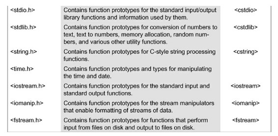
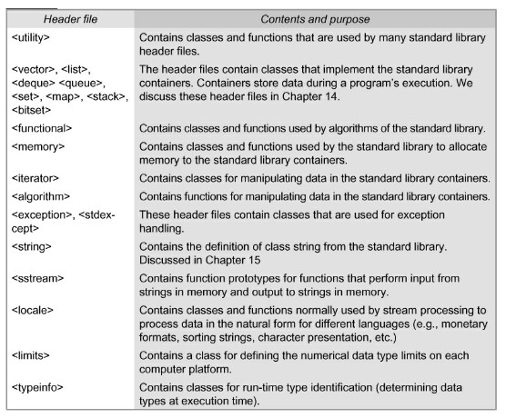
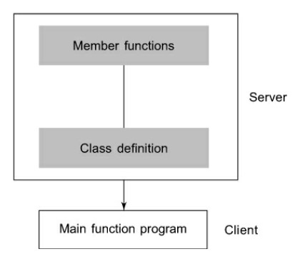

# Beginning C++

## Introduction to C++
C++ is an object-oriented programming language. It was developed by Bjarne Stroustrup at AT&T Bell Laboratories in Murray Hill, New Jersey, USA, in the early 1980’s. The object-oriented features in C++ allow programmers to build large programs with clarity, extensibility and ease of maintenance, incorporating the spirit and efficiency of C. C++ is a versatile language for handling very large programs. It is suitable for virtually any programming task including development of editors, compilers, databases, communication systems and any complex real-life application systems.

A simple C++ program which prints the string "Hello World!" to the STDOUT:

```C++

#include <iostream>
using namespace std;

int main()
{
    std::cout << "Hello World!\n"; 
    return 0;
}
```

Program execution in C++ begins at ```main()```, and every C++ program must have a ```main()```. In C++, main() returns an integer type value to the operating system. Apart from a few exceptions the compiler ignores whitespaces and newline characters, and therefore C++ is a free form language. Statements in C++ terminate with a semicolon.

### C++ Comments
C++ comments use a double slash ```//``` though C style comments using ```/* */``` are also valid. one notable difference is that C++ style comments cannot be used within the prgram text. For example,

```C++
for (int i = 0; i < n; // loop n times; n++);         // is invalid
for (int i = 0; i < n; /* loop n tims */; n++);       // is valid  
```

### Ouput and Input Streams
The identifier ```cout``` (pronounced as ‘C out’) is a predefined object that represents the standard output stream in C++. Here, the standard output stream represents the screen. It is also possible to redirect the output to other output devices.  

The operator ```<<``` is called the insertion or put to operator. It inserts (or sends) the contents of the variable on its right to the object on its left. The operator << is the bit-wise left-shift operator and it can still be used for this purpose. This is an example of how one operator can be used for different purposes, depending on the context. This concept is known as operator overloading, an important aspect of polymorphism.

The identifier ```cin``` (pronounced ‘C in’) is a predefined object in C++ that corresponds to the standard input stream. The operator ```>>``` is known as extraction or get from operator. It extracts (or takes) the value from the keyboard and assigns it to the variable on its right. Like <<, the operator >> can also be overloaded. The multiple use of << in one statement is called *cascading*.

```C++
cin >> a >> b;
sum = a + b;
cout << "Sum:" << sum << endl;
```
### The iostream file

```C++
#include <iostream>
```
It contains declarations for the identifier cout and the operator ```<<```. Some old versions of C++ use a header file called iostream, header files with ```.h``` extension are “old style” files.  Apart from ```#include```, the other pre-processor directives such as ```#define, #error,``` etc., work the same way as they would in C. But, their usage in C++ is quite limited due to the availability of other means for achieving the same functionality.

  


 ### Namespace
 Namespace is a new concept introduced by the ANSI C++ standards committee. This defines a scope for the identifiers that are used in a program. For example,
 
 ```C++
 using namespace std;
 ```
 
 std is the namespace where ANSI C++ standard class libraries are defined. All ANSI C++ programs must include this directive. This will bring all the identifiers defined in std to the current global scope. using and namespace are the new keywords of C++.

### An Example Program using Class:

```C++

#include <iostream>

using namespace std;

class Person
{
   int age;
   char name[30];
   
   public:
      void getData();
      void showData();
};

void Person::getdata()
{
   cout <<"Enter name of the person";
   cin >> name;
   cout << "Enter person's age";
   cin >> age;
}

void Person::showData()
{
  cout << "Name:" << name << "age:" << age <<endl;
}

int main()
{
    Person p;
    p.getData();
    p.showData();
    
    return 0;
}

```

### Structure of a C++ Program
* Include files
* Class declarations
* Member function definitions
* Main function program

It is a common practice to organize a program into three separate files. The class declarations are placed in a header file and the definitions of member functions go into another file. This approach enables the programmer to separate the abstract specification of the interface (class definition) from the implementation details (member functions definition). Finally, the main program that uses the class is placed in a third file which “includes” the previous two files as well as any other files required.

**Common C++ Source File Extensions: ```.cpp, .cc, .cxx, and .C```
**C++ header file extensions: ```.h, .hpp```

**CLient-Server Model**
This approach is based on the concept of client-server model as shown:



The class definition including the member functions constitute the server that provides services to the main program known as client. The client uses the server through the public interface of the class.

 
      

 


 
   
 


 

 

   
