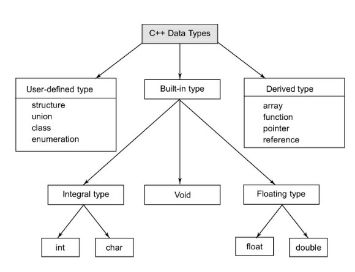
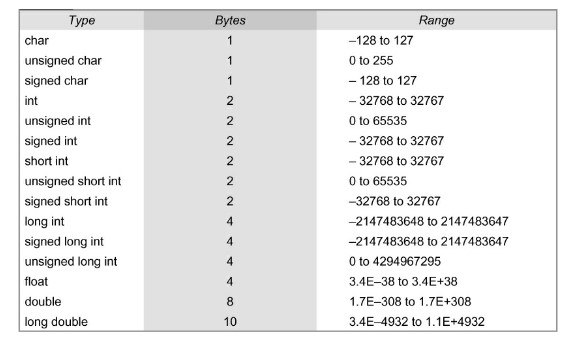

# Tokens-Expressions-in-C++

### Tokens in C++
The smallest individual units in a program are known as tokens. C++ has the following tokens: 

* Keywords
  * words which are explicitly reserved for a specific purpose and cannot be used as normal identifier names in a C++ program
      * e.g. ```auto, break, continue, for, while, if, else, return, switch etc.```
* Identifiers
  * Identifiers refer to the names of variables, functions, arrays, classes, etc.
  * Rules for naming identifiers:
    * Only alphabetic characters, digits and underscores are permitted
    * The name cannot start with a digit
    * Uppercase and lowercase letters are distinct
    * A declared keyword cannot be used as a variable name.
    * While ANSI C recognizes only the first 32 characters in a name, ANSI C++ places no limit on its length, therefore all characters are significant
* Constants
  * Constants refer to fixed values that do not change during program exeuction
  * C++ supports several constants - char (char, backslash char, wchar_t), integer (decimal, octal, hexadecimal), real constants, string constants etc.
* Strings
* Operators

> *Some Predefined Identifiers
   Beginning C++ programmers are sometimes confused by the difference between the two terms reserved word and predefined identifier, and certainly there is some potential for confusion.  
   One of the difficulties is that some keywords that one might "expect" to be reserved words just are not. The keyword main is a prime example, and others include things like the endl 
   manipulator and other keywords from the vast collection of C++ libraries.* 
   *For example, you could declare a variable called main inside your main function, initialize it, and then 
   print out its value (but you probably shouldn't, except as an experiment to verify that you can!). On the other hand, you could not do this with a variable named else. The difference 
   is that else is a reserved word, while main is "only" a predefined identifier. Here is a very short list of some of the predefined identifiers you may have encountered:  
   cin   endl     INT_MIN   iomanip    main      npos  std  
   cout  include  INT_MAX   iostream   MAX_RAND  NULL  string*
   
   
### Data Types in C++
Both C and C++ compilers support all the built-in (also known as basic or fundamental) data types. 



With the exception of void, the basic data types may have several modifiers preceding them to serve the needs of various situations. The modifiers signed, unsigned, long, and short may be applied to character and integer basic data types. However, the modifier long may also be applied to double. Data type representation is machine specific in C++.

ANSI C++ committee has added two more data types, bool and wchar_t.



