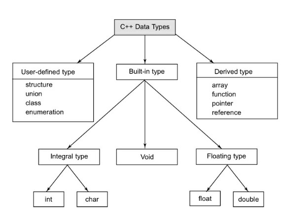
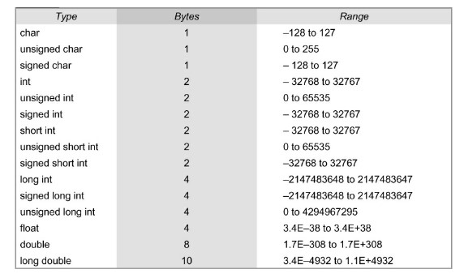

## Tokens in C++
The smallest individual units in a program are known as tokens. C++ has the following tokens: 

* Keywords
  * words which are explicitly reserved for a specific purpose and cannot be used as normal identifier names in a C++ program
      * e.g. ```auto, break, continue, for, while, if, else, return, switch etc.```
* Identifiers
  * Identifiers refer to the names of variables, functions, arrays, classes, etc.
  * Rules for naming identifiers:
    * Only alphabetic characters, digits and underscores are permitted (but this is usually reserved for external links.)
    * The name cannot start with a digit
    * Uppercase and lowercase letters are distinct
    * A declared keyword cannot be used as a variable name.
    * While ANSI C recognizes only the first 32 characters in a name, ANSI C++ places no limit on its length, therefore all characters are significant
* Constants
  * Constants refer to fixed values that do not change during program exeuction
  * C++ supports several constants - char (char, backslash char, wchar_t), integer (decimal, octal, hexadecimal), real constants, string constants etc.
* Strings
* Operators

#### Reserved Keywords and Predefined Identifiers
* Some keywords that one might "expect" to be reserved keywords words, just are not. The keyword ```main``` is a prime example, others include things like the ```endl``` manipulator and other keywords from the vast collection of C++ libraries. 
* For example, one can declare a variable called main inside main function, initialize it, and then print out its value. 
* On the other hand, this is not possible with a variable named else. 
* The difference is that ```else``` is a reserved word, while ```main``` is "only" a predefined identifier. 
* Here is a short list of some of the predefined identifiers in C++:
    * ```cin```
    * ```endl```
    * ```INT_MIN```
    * ```iomanip```
    * ```main```
    * ```npos```
    * ```std```
    * ```cout```
    * ```include```
    * ```INT_MAX```
    * ```iostream```
    * ```MAX_RAND```
    * ```NULL```
    * ```string```
   
**Compound Statement**
A compound statement is a group of statements (each of them terminated by its own semicolon), but all grouped together in a block, and enclosed in curly braces:

```C++
{ 
statement1; 
statement2; 
statement3; 
}
```

## Data Types in C++

A variable as a portion of memory which holds some data value. Every variable is associated with a type - i.e. the nature of the data that is stored - integer, character, floating point etc. C++ supports the following data types. 



With the exception of void, the basic data types may have several modifiers preceding them to serve the needs of various situations. The modifiers signed, unsigned, long, and short may be applied to character and integer basic data types. However, the modifier long may also be applied to double. Data type representation is machine specific in C++.  



In order to use a variable in C++, we must first declare it specifying which of the data types above we want it to be. The syntax to declare a new variable is to write the data type specifier that we want (like int, short, float...) followed by a valid variable identifier. For example:

```
int a;
float mynumber;
```
When declaring a local variable, its value is undetermined by default. But you may want a variable to store a concrete value the moment that it is declared. In order to do that, you have to append an equal sign followed by the value wanted to the variable declaration:

```
type identifier = initial_value ; 
```

For example, if we want to declare an int variable called a that contains the value 0 at the moment in which it is declared, we could write:

```
int a = 0;
```

Additionally, C++ has added a new way to initialize a variable - by enclosing the initial value between parenthesis ():

```
type identifier (initial_value) ; 
```

For example:

```
int a (0); 
```

## Storage Class Specifiers

### Variable Scope

In C++, the scope and lifetime of a variable are determined by it's storage class specifier. Scope - refers to the visibility or accessibility of the variable, whereas lifetime of a variable is the duration of time during which it remains active in memory.

### auto
```auto``` or local variable is the default storage class of any type of variable. In C++, the scope of a local variable is given by the block in which it is declared (a block is a group of instructions grouped together within curly brackets {} signs). If it is declared within a function it will be a variable with function scope, if it is declared in a loop its scope will be only the loop, etc.

### extern
An external variable is declared outside of all function but is accessible inside the function block. Also called global variable, its visibility is spread all across the program i.e. it is accessible by all the functions present in the program.

### static
A static variable has the visibility of a local variable but the lifetime of an external variable. That means, once declared inside a function block, it does not get destroyed after the function is executed, but retains its value so that it can be used by future function calls.

### register
Similar in behaviour to an automatic variable, a register variable differs in the manner in which it is stored in the memory. Unlike, automatic variables that are stored in the primary memory, the register variables are stored in CPU registers. The objective of storing a variable in registers is to increase its access speed, which eventually makes the program run faster. 

### void type in C++

## User Defined Types in C++
### Structures and Unions
### Classes
### Enum Types


## Derived Types in C++
### Arrays
### Functions
### Pointers
### Reference Variables


## Symbolic Constants


